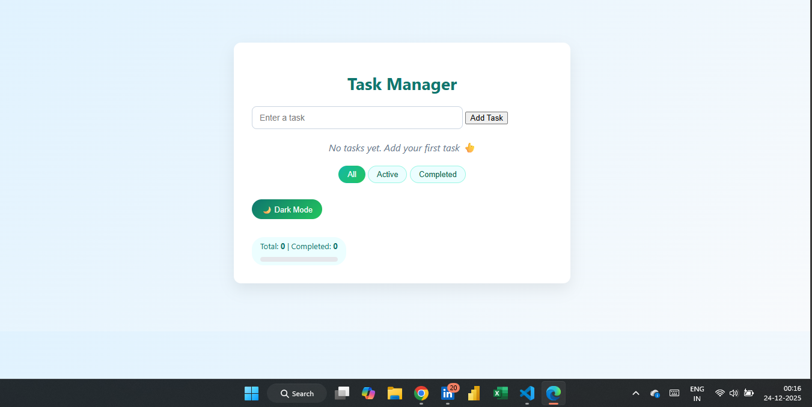
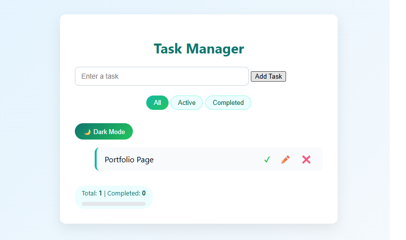
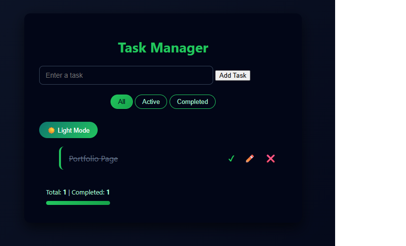

Project Name: Interactive Task Manager

Description:
The Interactive Task Manager is a web-based application that helps users
add, manage, and track daily tasks efficiently. Users can create tasks,
mark them as completed, edit or delete tasks, and filter tasks based on
their status. The application stores data using browser localStorage,
ensuring persistence even after page reload.

Objectives:
- Improve task organization and productivity
- Practice JavaScript DOM manipulation
- Implement localStorage-based persistence
- Build a user-friendly and accessible UI

Setup Instructions:

1. Download or clone the project repository
2. Extract the project folder (if zipped)
3. Open the project folder
4. Open index.html in any modern web browser (Chrome / Edge / Firefox)
5. No additional installation or server setup is required

Project Structure:

/index.html
- Main HTML file containing the UI structure

/css
  ├── style.css   → Main styling for layout and components
  ├── theme.css   → Dark mode theme styles

/js
  ├── app.js      → Main application logic (add, edit, delete, filter tasks)
  ├── ui.js       → UI rendering, animations, and statistics
  ├── storage.js  → localStorage save/load functions
  ├── utils.js    → Utility functions (ID generation)

This modular structure improves readability, reusability, and maintenance.

Technical Details:

- Tasks are stored as JavaScript objects:
  { id, text, completed }

- localStorage is used to persist task data between sessions

- DOM manipulation is used to dynamically render tasks

- Event listeners handle:
  - Task addition
  - Completion toggle
  - Editing
  - Deletion
  - Filtering

- Progress bar updates dynamically based on completed tasks percentage

Test Cases:

1. Add Task
   Input: "Portfolio Page"
   Expected Result: Task appears in task list

2. Mark Task Completed
   Action: Click ✔ button
   Expected Result: Task text strikes through and completed count increases

3. Delete Task
   Action: Click ❌
   Expected Result: Task is removed from list

4. Filter Completed Tasks
   Action: Click "Completed"
   Expected Result: Only completed tasks are displayed

5. Data Persistence
   Action: Refresh browser
   Expected Result: Tasks remain saved

## 🖼️ Screenshots

### Home Screen

### Add Task

### Completed Task

### Dark Mode

